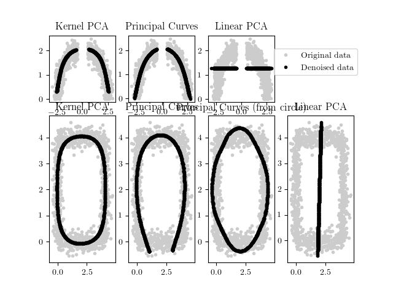

# dd2434-project
Project in DD2434 Machine Learning Advance Course, Winter 2016

## What did we do?
We reproduced the experiments presented in the paper [Kernel PCA and De-noising in Feature Spaces](docs/paper.pdf) by Sebastian Mika, Bernhard Schölkopf, Alex Smola Klaus-Robert Müller, Matthias Scholz and Gunnar Rätsch. In this regard, you can read our [report](docs/report.pdf) and our [presentation](docs/presentation.pdf)

## The experiments


In the paper, there are three major experiments:

* Toy example: 11 Gaussians
* Toy example: De-noising
* Digit denoising (USPS Dataset)

However, prior to

### Toy example: 11 Gaussians
The code related to this example can be found in [example1.py](example1.py).

Run the script as
```
python3 example1.py
```

By default, you should obtain the results (kPCA MSE, PCA PCA and their ratio) for 45 different settings of sigma.


### Toy example: De-noising
The code related to this example can be found in [example2.py](example2.py)

Run the script as
```
python3 example2.py
```

Once the execution has ended, a picture as follows should be displayed.



You might get some warnings, just ignore them.

### Digit denoising (USPS Dataset)
The code related to this example can be found in [example3.py](example3.py)

Run the script as
```
python3 example3.py
```


### Virtualenv setup
Install virtualenv
``` bash
sudo apt install python3-venv
```
Create a virtualenv somewhere
``` bash
python3 -m venv <env name>
```
Activate the environment and move to the ```<repo folder>```
``` bash
. <env name>/bin/activate
```
The first time, install the packages from ```requirements.txt```
``` bash
pip install -r requirements.txt
```
(If you install something with ```pip install``` remember to dump the packages installed and push the new requirements)
``` bash
pip freeze > requirements.txt
```
Deactivate the environment
``` bash
deactivate
```
